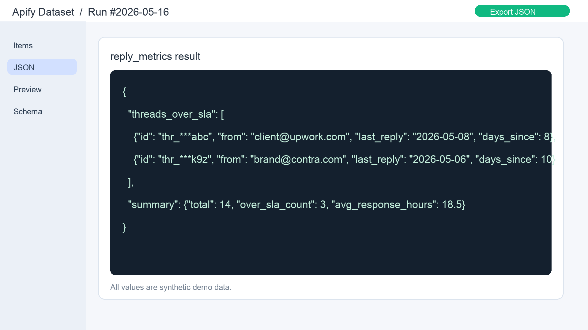
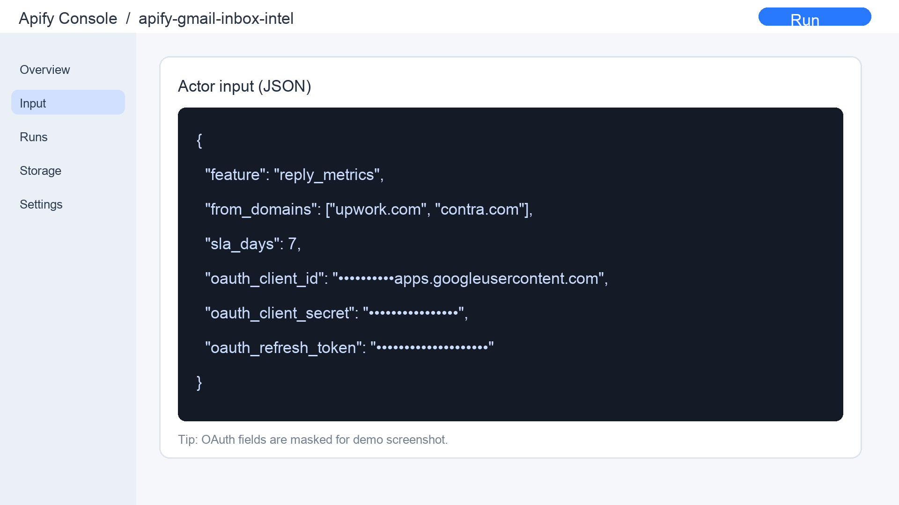

<p align="center">
  
</p>

<h1 align="center">Gmail Inbox Intelligence</h1>

<p align="center"><strong>Reply tracking, SLA monitoring, and unread digests for your Gmail — without a scraper, without a bulk sender, without storing your mailbox.</strong></p>

<p align="center">
  <a href="https://github.com/foxck016077/apify-gmail-inbox-intel/actions/workflows/test.yml"></a>
  <a href="LICENSE"></a>
  <a href="https://www.python.org/downloads/"></a>
  <a href="#privacy--oauth"></a>
  <a href="https://developers.google.com/gmail/api/auth/scopes"></a>
</p>

<p align="center">
  
</p>

A free, MIT-licensed [Apify Actor](https://apify.com/actors) for Gmail inbox workflow analytics — thread search, reply tracking, LLM summary, unread digest. Built on `gmail.readonly` OAuth scope. **Not a scraper, not a bulk sender, not a mailbox archiver.**

## 30-second start

1. **Click Run** on [apify.com/foxck/gmail-inbox-intel](https://apify.com/foxck/gmail-inbox-intel) (or `apify call foxck/gmail-inbox-intel` from CLI)
2. **Paste 3 OAuth fields** (`refresh_token`, `client_id`, `client_secret`) — see [OAUTH.md](OAUTH.md) for the 5-minute Google Cloud setup
3. **Read the dataset** — for `reply_metrics`, you get stalled threads ranked by SLA breach age, ready to paste into Friday triage

No subscription. No server-side mailbox cache. The Actor runs against the official Gmail API in `readonly` scope and exits.

**Want to see the output shape without setting up OAuth?** Set `"dry_run": true` in the input and the Actor skips Gmail entirely, emitting a 3-row synthetic dataset per feature so you can wire up downstream tooling first. See [`examples/05_dry_run_test.json`](examples/05_dry_run_test.json) or this sample run: [Apify console run JnZVfjPrexOfeoSdF](https://console.apify.com/actors/w1viWQDuCUooRYfzk/runs/88ZYxNKtcKiReuDET).

📖 Design notes + build log on dev.to — [**ZERO-TEN cold-start build log (11 posts)**](https://dev.to/foxck016077/series/39853):
- [Apify Actor for Gmail inbox analytics: refresh-token-only OAuth, async router, per-feature quota](https://dev.to/foxck016077/an-apify-actor-for-gmail-inbox-analytics-a-refresh-token-only-oauth-async-router-per-feature-pi2)
- [Gmail OAuth client_id is not a secret — design notes for self-host Actors](https://dev.to/foxck016077/gmail-oauth-clientid-is-not-a-secret-a-design-notes-for-self-host-actors-19af)
- [Why refresh-token-only OAuth for a multi-tenant Apify Actor](https://dev.to/foxck016077/why-i-picked-refresh-token-only-oauth-for-a-multi-tenant-apify-actor-265c)
- [Per-feature quota in Apify KeyValueStore — no DB, no cron, no drift](https://dev.to/foxck016077/per-feature-quota-in-apify-keyvaluestore-no-db-no-cron-no-drift-36p4)
- [Open-sourcing an MIT Apify Actor in 24 hours — a build log](https://dev.to/foxck016077/open-sourcing-an-mit-apify-actor-in-24-hours-a-build-log-53km)
- [Apify Actor pricing patterns: Free tier + Pro + Pay-per-result](https://dev.to/foxck016077/apify-actor-pricing-patterns-free-tier-pro-pay-per-result-designing-for-indie-buyers-4e4l)
- [Spinning a $9 PDF off a $0 open-source actor in 4 hours — a build log](https://dev.to/foxck016077/spinning-a-9-pdf-off-a-0-open-source-actor-in-4-hours-a-build-log-2k7i)
- [7 articles, 1 star, 0 sales, 4 days — what an MIT open-source Apify Actor cold start actually looks like](https://dev.to/foxck016077/7-articles-1-star-0-sales-4-days-what-an-mit-open-source-apify-actor-cold-start-actually-looks-j7l)
- [Cold start day 6 — switching the $9 PDF to pay-what-you-want and opening 30% affiliate](https://dev.to/foxck016077/cold-start-day-6-switching-the-9-pdf-to-pay-what-you-want-and-opening-30-affiliate-37im)
- [Day 7 — funnel audit found 7 of 9 articles had no buy link, then I pivoted the product](https://dev.to/foxck016077/day-7-funnel-audit-found-7-of-9-articles-had-no-buy-link-then-i-pivoted-the-product-10ci)
- **[Day 8 — I scraped 5 freelance Gumroad top sellers. All 5 wrote one thing I didn't.](https://dev.to/foxck016077/day-8-i-scraped-5-freelance-gumroad-top-sellers-all-5-wrote-one-thing-i-didnt-4o0)** (outcome-first vs problem-first hook hypothesis)

💬 [Discussions](https://github.com/foxck016077/apify-gmail-inbox-intel/discussions) — design questions, roadmap, open trade-offs.
🗺️ [Roadmap](ROADMAP.md) — what's planned, what's speculative, what's explicitly out of scope.
📝 [Changelog](CHANGELOG.md) — what changed in each release.
💝 [Gumroad listing](https://foxck.gumroad.com/l/apify-gmail-inbox-intel) — pay-what-you-want download + email updates when new releases ship.

> **Want to self-host this Actor?** Bundle the full source + `docker-compose.yml` + OAuth setup script + docs into one PWYW download:
> **[Gmail Inbox Intel — Self-Host Bundle](https://foxck.gumroad.com/l/freelancer-gmail-tracking-pack)** — Apify Actor source (Python 3.11, MIT), Docker Compose stack, 5-minute OAuth setup, local KVS storage, no Apify cloud lock-in. Same listing also bundles the original Freelancer Gmail Tracking Pack (30 labels + 12 filters + 5 email templates + Apps Script + 26-page PREMIUM bundle PDF) as a bonus. Pay what you want from $5, suggested $19. 30% affiliate at [foxck.gumroad.com/affiliates](https://foxck.gumroad.com/affiliates).

## Features

- **`thread_search`** — search Gmail threads by query, paginate, return metadata + message counts
- **`reply_metrics`** — for each thread, compute reply-from-me / reply-from-others / last reply age / SLA breach flag
- **`summarizer`** — optional OpenAI LLM thread summary (you supply your own API key)
- **`unread_digest`** — list unread threads in last N hours, grouped by label

## Use Cases

- **Freelancer Friday triage**: `reply_metrics` against `from:client-domains newer_than:21d`, sort by `last_reply_age_days desc`, send Day-3/7/14 bumps to anything past the threshold. Replaces a CRM if you have < 50 active threads.
- **Sales / BD pipeline rot**: `reply_metrics` against `label:outbound` weekly, alert when `reply_from_other` is empty 14d+. Cheaper than HubSpot for a small list.
- **PM / Ops morning digest**: `unread_digest` against the last 12h grouped by `label`. Cron from Apify schedule → email yourself the dataset URL.
- **Personal weekly review**: `thread_search` for `is:starred OR label:important newer_than:7d` → triage backlog without forwarding emails to a third party.

## Privacy & OAuth

- You provide your own OAuth credentials in Actor input (`refresh_token` + `client_id` + `client_secret`)
- Refresh-token-only flow — Actor exchanges for short-lived access token in memory each run
- Job-end state is cleared (best effort)
- **We never store your Gmail.** Every run uses your own OAuth, no server-side mailbox cache.

## Pricing

**Free.** MIT licensed. Run it on Apify (their compute-unit pricing applies — usually pennies per run) or fork and run on your own box.

The repo includes a `free_tier_user_id` quota hook for future-self if you want to wrap it as a paid SaaS, but no billing layer ships with this Actor. If you'd rather pay for a setup instead of self-hosting OAuth, the [PWYW $1+ manual companion pack](https://foxck.gumroad.com/l/freelancer-gmail-tracking-pack) (now includes a 26-page bundle PDF) skips OAuth entirely.

## Input Schema (8 fields)

| Field | Type | Required | Notes |
|---|---|---|---|
| `feature` | enum | yes | `thread_search` / `reply_metrics` / `summarizer` / `unread_digest` |
| `oauth_token` | object | yes | `{refresh_token, client_id, client_secret}` |
| `query` | string | no | Gmail search query (default `in:inbox`) |
| `max_results` | integer | no | default 50, max 500 |
| `openai_api_key` | string | no | required only for `summarizer` |
| `summary_model` | string | no | default `gpt-4o-mini` |
| `free_tier_user_id` | string | no | for free-tier quota tracking |
| `dry_run` | boolean | no | skip Gmail API calls (test mode) |

See `.actor/INPUT_SCHEMA.json` for full spec, and [`examples/`](examples/) for 5 ready-to-paste input JSON files per feature.

<p align="center">
  
</p>

## Local Dev

```bash
python -m venv .venv
source .venv/bin/activate
pip install -r requirements.txt
pytest               # 6 tests, asyncio_mode=auto
apify run            # local actor run with .actor/INPUT_SCHEMA.json
```

## Related Projects

Browsing the Apify ecosystem? See [**awesome-apify-actors**](https://github.com/foxck016077/awesome-apify-actors) — a curated list of 68+ production Apify Actors across 16 categories (Scrapers, Search, Maps, Social media, Lead gen, Email). This Actor is listed under *Email & Productivity*.

Looking for ready-to-import Gmail / AI / n8n templates? Some Gumroad workflows that pair well with this Actor:

- **AI Lead Auto-Responder** — Gmail → AI replies n8n workflow: https://foxck.gumroad.com/l/ai-lead-responder
- **AI Content Pipeline** — RSS → Social Media n8n template: https://foxck.gumroad.com/l/ai-content-pipeline
- **Competitor Monitor** — Daily AI analysis + weekly reports n8n: https://foxck.gumroad.com/l/competitor-monitor
- **Claude Code Mastery** — practical playbook for Claude Code workflows: https://foxck.gumroad.com/l/claude-code-mastery

Full catalog: https://foxck.gumroad.com

## License

MIT — see `LICENSE`.
